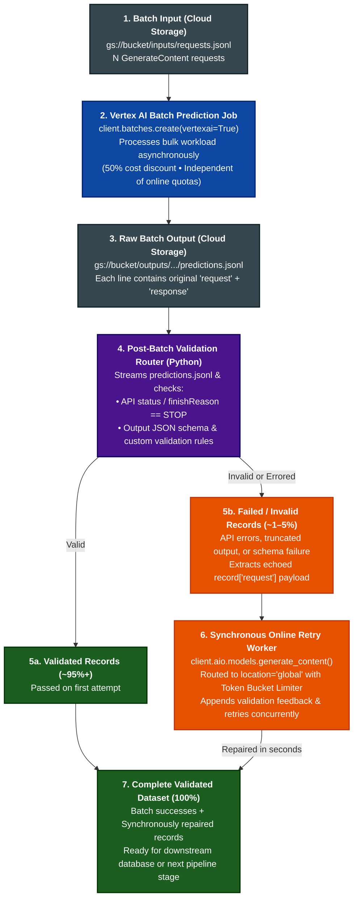

# Vertex AI Batch Prediction + Synchronous Exception Retry Demo (`google-genai` SDK)

A reference architecture and live terminal dashboard demonstrating the **"Batch the Bulk, Synchronously Retry the Exceptions"** pattern on Vertex AI using the unified **`google-genai` SDK (`vertexai=True`)**.

---

## Why This Pattern?

When processing large volumes of structured extraction or multimodal prompts on Vertex AI:
1. **Bulk Execution via Vertex AI Batch Prediction (`client.batches.create`)** gives you a **50% cost discount** over Standard PayGo and bypasses online per-minute rate limits (`429 RESOURCE_EXHAUSTED`).
2. **Synchronous Online Exception Retries (`client.aio.models.generate_content`)** solve the "tail latency" problem of batch validation failures. If ~1–5% of batch records fail schema validation or hit token truncation (`MAX_TOKENS`), submitting a brand-new batch job just for those few stragglers would incur another several minutes of batch queue overhead.
3. Because Vertex AI Batch Prediction automatically echoes the original `"request"` payload alongside the `"response"` in every line of `predictions.jsonl`, a Python post-processor can immediately replay only the failed records synchronously against the Vertex AI **`global`** endpoint (wrapped in a token-bucket rate limiter) and merge the repaired records back into the dataset in seconds.

---

## Architecture Diagram



---

## Quickstart (First-Try Execution on a Brand-New GCP Project)

### 1. Provision Project APIs, Service Agent IAM, GCS Bucket, & Python `.venv`
Run `scripts/setup.sh` with your GCP Project ID. It enables the required APIs (`aiplatform.googleapis.com`, `storage.googleapis.com`, `serviceusage.googleapis.com`), provisions the Google-managed Vertex AI Service Agent (`service-<PROJECT_NUMBER>@gcp-sa-aiplatform.iam.gserviceaccount.com`), creates the staging GCS bucket, grants bucket IAM permissions, and installs Python dependencies into `.venv`:

```bash
chmod +x scripts/setup.sh scripts/teardown.sh
./scripts/setup.sh <YOUR_PROJECT_ID>
```

*(Optional: You can also pass `[REGION] [BUCKET_NAME] [GCLOUD_ACCOUNT]`, e.g. `./scripts/setup.sh my-project us-central1 my-bucket user@example.com`.)*

### 2. Run the Batch + Synchronous Retry Demo (Live In-Place Console Dashboard)
The demo generates 5 synthetic `GenerateContent` requests (`REC-001` through `REC-005`), where:
* **`REC-001`, `REC-002`, `REC-005`** succeed in the batch job on the first pass.
* **`REC-003`** intentionally omits a required schema field (`extracted_items`) during the batch pass so it fails Step 4 validation and triggers the synchronous online retry worker.
* **`REC-004`** intentionally sets `maxOutputTokens: 8` in the batch request so it truncates (`finishReason=MAX_TOKENS`) and also triggers the synchronous online retry worker.

```bash
./.venv/bin/python src/batch_with_sync_retries.py --project_id <YOUR_PROJECT_ID>
```

To replay the validation and live synchronous online retry flow immediately against an already-completed batch job (completes in ~4 seconds):

```bash
./.venv/bin/python src/batch_with_sync_retries.py \
  --project_id <YOUR_PROJECT_ID> \
  --existing_job_name projects/<PROJECT_NUMBER>/locations/us-central1/batchPredictionJobs/<JOB_ID>
```

---

## Live Terminal Dashboard Preview

```text
========================================================================================
   VERTEX AI (google-genai SDK): BATCH PREDICTION + SYNCHRONOUS RETRY PIPELINE
========================================================================================
                  +---------------------------------------------------------+
                  | 1. Batch Input (Cloud Storage)            [✓ DONE     ] |
                  |    URI: .../o/run_1790366241/inputs/requests.jsonl      |
                  |    Payload: 5 GenerateContent requests (JSONL)          |
                  +---------------------------------------------------------+
                                               |
                                               v
                  +---------------------------------------------------------+
                  | 2. Vertex AI Batch Prediction Job         [✓ DONE     ] |
                  |    SDK: client.batches.create(vertexai=True)            |
                  |    Job ID: 3353243704298045440                          |
                  |    State:  JOB_STATE_SUCCEEDED        Elapsed:  196s    |
                  +---------------------------------------------------------+
                                               |
                                               v
                  +---------------------------------------------------------+
                  | 3. Raw Batch Output (Cloud Storage)       [✓ DONE     ] |
                  |    predictions.jsonl (5/5 records downloaded)           |
                  |    Each line echoes original 'request' + 'response'     |
                  +---------------------------------------------------------+
                                               |
                                               v
                  +---------------------------------------------------------+
                  | 4. Post-Batch Validation Router (Python)  [✓ DONE     ] |
                  |    Checks finishReason == STOP & JSON schema rules      |
                  +---------------------------------------------------------+
                                 /                           \
                    (Valid JSON)                              (Invalid / Truncated)
                               /                               \
                              v                                 v
  +-----------------------------------------+     +-----------------------------------------+
  | 5a. Validated Records     [✓ DONE     ] |     | 5b. Failed / Invalid      [✓ DONE     ] |
  |     Passed 1st Attempt:  3 / 5          |     |     Needs Sync Retry:    2 / 5          |
  |     IDs: REC-001, REC-002, REC-005      |     |     IDs: REC-003, REC-004               |
  +-----------------------------------------+     +-----------------------------------------+
                      |                                                 |
                      |                                                 v
                      |                           +-----------------------------------------+
                      |                           | 6. Sync Online Retry      [✓ DONE     ] |
                      |                           |    client.aio.models.generate_content   |
                      |                           |    Endpoint: location='global'          |
                      |                           |    Repaired Online:  2 / 2              |
                      |                           +-----------------------------------------+
                      \                                                 /
                       \               (Merged in seconds)             /
                        \                                             /
                         v                                           v
                  +---------------------------------------------------------+
                  | 7. Complete Validated Dataset (100%)      [✓ DONE     ] |
                  |    Final Validated Records:  5 / 5                      |
                  |    (3 from Batch @ 50% discount + 2 Sync Retried)       |
                  +---------------------------------------------------------+
----------------------------------------------------------------------------------------
 LIVE ACTIVITY STREAM:
  [19:57:23] ✗ REC-004 FAILED: Abnormal finishReason=MAX_TOKENS (output truncated)
  [19:57:24] ✓ REC-001 PASSED: Cloud telemetry analysis for REC-001 indicates an average CPU utilization of 42% across 12 nodes with no packet loss.
  [19:57:24] Routing 2 failed record(s) to Stage 6 Synchronous Online Retry Worker...
  [19:57:25] ↳ [Sync Retry #1] REC-003 (Missing or empty required fields: ['extracted_items']) -> global endpoint...
  [19:57:25] ↳ [Sync Retry #1] REC-004 (Abnormal finishReason=MAX_TOKENS (output truncated)) -> global endpoint...
  [19:57:26] ✓ [Sync Retry Repaired!] REC-004: Network firewall rules and load balancer TLS configuration analyzed.
  [19:57:27] ✓ [Sync Retry Repaired!] REC-003: Analysis of storage lifecycle policy involving 40TB archived to Coldline.
  [19:57:27] PIPELINE COMPLETE: 5/5 records validated (100%)!
========================================================================================
```

---

## Teardown & Cleanup

To cancel/delete all demo `BatchPredictionJobs` created in Vertex AI, delete the Cloud Storage bucket (`gs://<PROJECT_ID>-vertex-batch-demo`) and all objects inside it, and remove the local `.venv`:

```bash
./scripts/teardown.sh <YOUR_PROJECT_ID>
```
